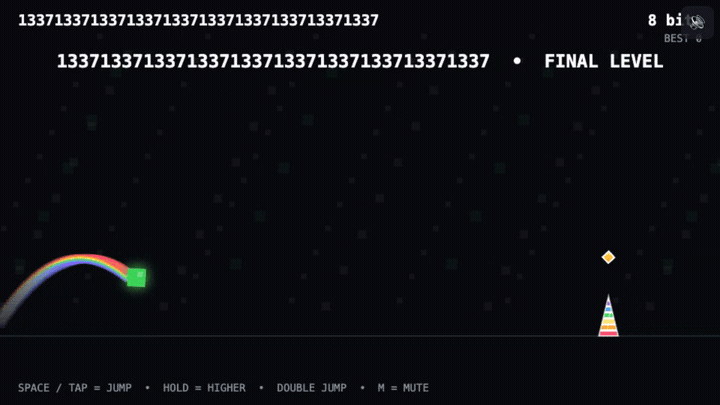

# F1NA113VE1

F1NA113VE1 is a tiny, rainbow-soaked infinite_-ish_ runner built for the js13kGames challenge.

You play as a green GitHub contribution square racing to avoid downtime, double-jumping over angry GitHub unicorn horns in a procedurally generated world. Each jump leaves a beautiful double rainbow. WHAT DOES IT MEAN!?!?

The game starts absurdly late, at the final level, and only gets faster and more frantic from there. Angry unicorn horns burst from the ground, drop from the ceiling, and occasionally fire across the screen.

Make it to the end (106,496 bits), and you win. LOL.

<p align="center">
  
</p>

## How to play

The game **waits for you** — it never auto-runs. Read the on-screen briefing, then:

- **Start:** your first press/tap both starts the run and performs the first jump.
- **Jump:** `Space` / `↑` / `W` / click / tap.
- **Jump higher:** *hold* the press — releasing early gives a shorter hop (variable-height jump).
- **Double jump:** press *again while in the air*. You get two jumps, refreshed on landing.
- **Mute:** press `M`, or tap the speaker button (top-right). The mute button never starts a run or jumps.

Tuned coyote-time and input-buffering make jumps feel forgiving without ever granting a third jump.

### Rainbow bits (combo bonus)

Optional glowing rainbow **bits** float along some jump arcs. Grabbing them builds a **combo** and adds a small
**bonus** shown in the HUD. Bits are pure risk/reward: they never change your distance, speed, milestones, or the
win condition. **Missing** a bit resets your combo. Restarting a run clears all bonus/combo/bit state.

### Fair, speed-aware obstacles

Obstacle spacing scales with your current speed so every pattern stays reachable, with a genuine recovery window
between hazards. Tricky hazards (tall pillars, ceiling drops, falling horns, saw blades, step-up horns, gates) show
a **consistent solid warning marker** in advance. Every generated template is verified clearable at min/mid/max
speed by simulating the real game physics (see *Regression tests*).

- **Step-up horns** — a horn so tall that **no ground jump can clear it, not even a perfectly timed double jump**.
  The template hands you a short 48/72/90 staircase, but its first riser sits *above* the auto-step threshold, so
  you cannot walk up it — you must **jump onto the steps** to reach the launch height and then leap from the top.
  Simulation proves the bare horn is impossible from flat ground, that merely running the steps never clears the
  template, and that only a path which jumps onto the steps clears it — while an idle runner never leaves the
  ground and is impaled by the horn.
- **Flappy gates** — a floor horn and a ceiling horn stacked in the same column with a jumpable corridor between
  them, à la Flappy Bird. You must jump high enough to clear the bottom horn while staying under the top one; a
  reckless full double jump clips the ceiling. The safe corridor is verified threadable at every speed.

### Procedural terrain: platforms, steps & pits

Beyond the horn obstacles, the world builds itself from Geometry-Dash-style terrain that unlocks as you get faster:

- **Solid slabs** — plain ground-anchored blocks with a green top edge. You can land on top for a stable footing
  that refreshes both jumps. Unlike the bashful platform, a solid never gets shy, never retreats and never drops
  away — and touching its side is never lethal.
- **Stair steps** — a short ascending run of solid blocks. Ride up them or double-jump straight over; either way
  they stay within reach of the variable-height / double-jump physics and never kill you.
- **Ground pits** — genuine gaps in the floor, drawn with red edges. The ground support really disappears over a
  pit, so an un-jumped gap drops you **below the world and kills you**. Every generated pit width is verified
  jumpable at min/mid/max speed and at the deterministic RNG extremes, with runway before and after.

Terrain shares the same speed-aware spacing, hostile/reverse-boost motion and portrait/hidden/blur freeze as every
other world entity, and normal jump obstacles stay the dominant element.

### Things that are not on your side

Further into a run, five telegraphed **rage-bait** elements unlock gradually and appear at modest probability, so
the normal jump rhythm always stays dominant. None of them is lethal on its own, none awards points, and all are
learnable — the joke only lands once:

- **Bashful platform** — a small rainbow platform with a `^_^` face. It is genuinely landable (well inside one
  full-hold jump) and refreshes both jumps, but as you get close it turns `>_<`, retreats and drops away. It is
  never required to clear a hazard.
- **Hostile power-up** — a red spiked star with a pulsing `!` telegraph. Collecting it does not kill you and pays
  no bit/combo, it just briefly speeds up **world obstacle motion**. Your distance and score pace are unchanged.
- **Reverse boost** — a blue star marked `⇄`. Collecting it briefly scrolls the world *backwards*: obstacles,
  coins, platforms, springs, gusts and the spawn cursor all move right together, and you visually slide back
  before being restored. Distance keeps climbing at the normal rate, and nothing extra is spawned.
- **Wind tunnel** — a telegraphed column with a `!` that turns into a live purple updraft. While it warns, it is
  completely inert. The moment you enter a live tunnel it **toggles your gravity mode**: on the floor you get
  lifted to the ceiling; on the ceiling you get dropped back to the floor. Each live tunnel toggles exactly once
  and mode persists after you leave — you stay upside down running along the ceiling **until the next wind flips
  you back**. Jumping is sign-aware in both modes (hold, release-cut and double jump all work), and while inverted
  the ceiling at `WT` acts as a real floor: you rest against it and land on it. Procedural terrain generated while
  you are inverted is mirrored to the ceiling — slabs and stairs hang down from the top, gaps become **ceiling
  pits** that drop you *up* through the world (lethal, like a floor pit), and step-hazard horns spawn as ceiling
  horns. Ground and ceiling terrain are strictly isolated: floor pits/solids only affect the floor runner and
  ceiling pits/solids only affect the ceiling runner.
- **Nearly helpful spring** — a coil that bounces you on a descending top contact, but only about half as high as
  a real jump, and then quietly cuts the rise short. Your double jump is still available afterwards.

## Mobile & landscape

The game runs on touch devices and fills a **16:9** world inside the landscape viewport, honoring dynamic viewport
height (`dvh`) and safe-area insets. Touch supports press / hold / release / double-jump with robust multi-pointer,
repeat and cancel handling.

**Landscape is required.** In portrait — on load or if you rotate mid-run — a readable rotate overlay appears, the
simulation **freezes** (your player, obstacles and score are preserved exactly, with no time catch-up), and gameplay
input is ignored. Returning to landscape shows a deliberate **tap-to-resume** prompt; resuming never triggers an
accidental jump. Backgrounding the tab (hidden/blur) freezes the same way, so you can't die while away. Rotation is
detected from the viewport — no `screen.orientation.lock` or fullscreen APIs are used.

## Reduced motion

If your system requests reduced motion (`prefers-reduced-motion: reduce`), decorative motion is suppressed —
screen shake, flashing, rainbow trails/particles, the player's spin, and the animated parallax background — both on
initial load **and** live when you change the preference. All real gameplay motion, physics and timing are preserved,
and hazard warnings render as solid, readable markers.

## Build / packaging

The whole game is a single self-contained `index.html` (no runtime assets or libraries; `assets/header.svg` is
README art only). Package the js13k submission archive with the standard library only:

```sh
python3 scripts/package.py
```

This writes the reproducible, ignored artifact `dist/F1NA113VE1.zip` (fixed timestamps + permissions, DEFLATE level 9)
containing **only** `index.html`, and **fails if the archive exceeds 13,000 bytes**.

### About the byte limit

The js13k limit applies to the **zipped archive**, which must be ≤ 13,312 bytes. This project gates at a conservative
**13,000 bytes**. The current archive is well under that (~8.6 kB); the raw `index.html` is larger than 13 kB but that
is expected and fine — the *archive* is the submission artifact.

## Regression tests

Deterministic tests run the real production code (no test hooks live in `index.html`) via Node's built-in test
runner and `vm`:

```sh
node --test scripts/test.mjs
```

They cover onboarding/start/first-jump, hold vs tap height, the double-jump limit with coyote/buffer, coin
hit/miss and combo reset, distance staying independent of bonus, mute isolation, single-pointer/repeat/cancel
handling, portrait/hidden/blur freeze (no input, no catch-up) and deliberate resume without a jump, live
reduced-motion clearing, per-template fairness across speeds, generator spacing / no saw overtaking, and the
packaging gate.

The rage-bait elements have their own coverage: run-reset of every new entity array and timer, emitted shape/gap
integrity (no lethal obstacle, no coin), the bashful platform's top landing plus its retreat/drop trigger, the
hostile power-up's zero scoring and 1.5x world motion with untouched distance pace, reverse scrolling moving every
world array *and* the spawn cursor by an identical delta with no extra spawns and no distance loss, the gust's
grounded/airborne asymmetry, the spring's weak bounce, cut rise and preserved double jump, gradual generator
unlocks with normal templates still dominant, and a no-input survivability sweep at every speed and rng extreme.

The procedural terrain adds its own coverage too: run-reset of the solids/pits arrays, emitted slab/stairs/pit
shape integrity (no lethal obstacle, no coin), a solid's stable top landing that restores jumps with no retreat or
drop, stair mounting, a pit removing ground support and killing by a fall below the world (with support restored on
the far side), every generated pit width jumpable at min/mid/max speed and rng extremes, pits never overlapping an
obstacle/solid/pit, terrain moving under hostile/reverse boost and freezing under pause, and a render smoke test in
both motion modes. The **ceiling** side mirrors this coverage: emitting while inverted produces flagged
ceiling slabs, descending ceiling stairs, ceiling pits and a mirrored step-hazard shape; single/double/triple
mirrored horns are guaranteed tall enough to hit a ceiling runner; auto-step brings a ceiling runner onto a slab's
bottom face; ceiling terrain is invisible to a grounded runner and floor terrain is invisible to a ceiling runner;
a ceiling pit drifts the runner up through the top and kills; ceiling stairs are climbable without jumping; and
ceiling terrain scrolls and renders in both motion modes.

The step-up horns, flappy gates and wind tunnel each add dedicated coverage: numerical search proving a step-up
horn is impossible from flat ground, that merely running its steps never clears it, and that only a path which
jumps onto the steps clears it at every speed, plus a check that an idle runner never rises and is impaled; the gate's aligned
floor+ceiling pair, real corridor height and threadability at every speed plus a forced-jump death check; and the
wind tunnel's inert warning, **one toggle per live wind** (up on the first, down on the next), persistent inverted
mode after exit with no floor snap, sign-aware down-jump with hold/double, ceiling landing, idle survivability and
restart reset.

## Theme interpretation

The theme was rainbows and unicorns. This game combines:

- GitHub's angry unicorn from its 500 pages
- A double-rainbow jump (get it? the old double rainbow meme?)
- Horns as obstacles
- A green GitHub contribution square
- A 1,337-bit milestone and 13 KB of everything

## Disclaimers, fun facts

🤖 Used GitHub Copilot ChatGPT Sol 🤖
🤓 Every commit in this repo starts with `133713`
📜 More time was spent writing the README than the game.
